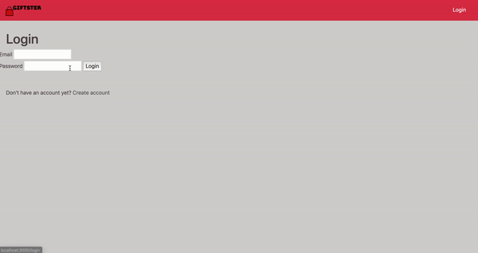

# README

This app is a gift exchange app. It allows you to log in, create gift exchange events, create wishes and wishlists for those events and view other attendees and their wishlists for the exchanges.

## Watch the video to see how it works: ##

# Instructions

1. Fork and clone this repo
2. Run 'bundle install' in your terminal
3. Run 'rails s' in your terminal to start the server
4. Navigate to 'localhost:3000/signup' and create a user account.
5. Run 'rails db:seed' in your terminal to seed your database.
6. Continue in 'localhost:3000'

